## JotPsych — Clinic Intelligence Scraper

Extract key clinic metadata from a website (single URL or CSV batch) using a polite crawler and an LLM with a strict JSON schema.

Output schema:
```json
{
  "clinic_info": {
    "specialty": "string",
    "modalities": "string",
    "location": "string",
    "clinic_size": "string"
  }
}
```

### What it does
- Crawls same-domain pages (About, Team/Providers/Physicians, Services/Specialties, Locations/Contact, etc.)
- Cleans visible text and reads JSON‑LD if present
- Builds lightweight “evidence” (candidate locations, provider name/count hints, specialty/modality tokens)
- Calls an LLM (Gemini 2.5 Pro by default) with a strict response schema and temperature=0
- Iteratively expands the crawl if any field is still unknown; optional final exhaustive crawl fallback
- Writes JSONL/JSON/CSV with pretty defaults for readability

---

## Requirements
- Python 3.10+
- Gemini API key exported as `GEMINI_API_KEY` (or `GOOGLE_API_KEY`)
- Recommended: a `.env` file (auto‑loaded if `python-dotenv` is installed)

Install deps:
```bash
pip install -r requirements.txt
```

`.env` example:
```bash
GEMINI_API_KEY=your_key_here
```

---

## Quick start

### Interactive (recommended)
Run without arguments and follow the prompts:
```bash
python jotpsych_scraper.py
```

### One URL
```bash
python jotpsych_scraper.py \
  --url https://exampleclinic.com \
  --provider gemini \
  --out results.jsonl
```

### CSV batch (CSV must contain a `url` column)
```bash
python jotpsych_scraper.py \
  --input_csv example_clinics.csv \
  --provider gemini \
  --out results.jsonl
```

---

## Output formats
- `.jsonl` (default): pretty JSON blocks by default; add `--compact` for one‑line records
- `.json`: pretty JSON (single object for one URL, or list for many)
- `.csv`: flattened `clinic_info` fields into columns

Example pretty block (JSONL):
```json
{
  "clinic_info": {
    "specialty": "",
    "modalities": "",
    "location": "",
    "clinic_size": ""
  }
}
```

---

## Flags you’ll actually use
- `--provider`: `gemini` (default), `openai`, or `anthropic`
- `--max_pages` (default 20): initial page budget
- `--max_depth` (default 2): initial crawl depth
- `--no_exhaust`: disable iterative expansion when unknowns remain
- `--max_total_pages` (default 120): cap when expanding pages
- `--max_total_depth` (default 3): cap when expanding depth
- `--exhaust_all_if_unknown`: if unknowns remain, crawl all same‑domain HTML pages up to a high safety cap
- `--pretty` / `--compact`: formatting control (JSON/JSONL)
- `--out`: choose `.jsonl`, `.json`, or `.csv`

---

## Troubleshooting
- “Missing GEMINI_API_KEY …”: export the key or add to `.env`
- Output is one line per record: add `--pretty` or use `.json` output, or omit `--compact`
- No results: site blocks bots or is client‑rendered; try increasing `--max_pages/--max_depth` or consider a headless fetch strategy
- Still “unknown” fields: use `--exhaust_all_if_unknown` or run with a larger `--max_total_pages`/`--max_total_depth`

---

## Repo layout
```
.
├─ jotpsych_scraper.py     # Main CLI/crawler/LLM
├─ AI_PROMPT.md            # System prompt and extraction rules
├─ example_clinics.csv     # Example CSV for batch runs
├─ requirements.txt        # Dependencies
├─ diagram.md              # Flow diagram (view on GitHub)
└─ README.md               # This file
```

---

## Development Process

This project was architected through collaborative sessions with GPT and Claude, iteratively refining the approach to clinic website intelligence extraction. The development process involved several key phases:

### Development Process Flow Chart

```mermaid
flowchart TD
    A["Initial Problem: Extract Clinic Metadata"] --> B["AI Collaboration Session 1<br/>GPT + Claude Architecture"]
    B --> C["Define Requirements<br/>- Specialty, Modalities<br/>- Location, Clinic Size<br/>- Polite Web Scraping"]
    C --> D["Design Multi-Stage Pipeline<br/>- URL Discovery<br/>- Content Extraction<br/>- LLM Intelligence"]
    D --> E["AI Collaboration Session 2<br/>Technical Implementation"]
    E --> F["Implement Core Components<br/>- Web Crawler<br/>- Content Parser<br/>- Evidence Builder"]
    F --> G["AI Collaboration Session 3<br/>LLM Integration"]
    G --> H["Add Multi-Provider Support<br/>- Gemini (default)<br/>- OpenAI<br/>- Anthropic"]
    H --> I["AI Collaboration Session 4<br/>Error Handling & Optimization"]
    I --> J["Implement Advanced Features<br/>- Iterative Expansion<br/>- Exhaustive Fallback<br/>- Multi-format Output"]
    J --> K["Testing & Refinement<br/>- Real Clinic Websites<br/>- Edge Case Handling<br/>- Performance Tuning"]
    K --> L["Documentation & Deployment<br/>- README & Examples<br/>- GitHub Repository<br/>- Usage Instructions"]
    L --> M["Final AI Review<br/>Code Quality & Documentation"]
    M --> N["Production Ready<br/>JotPsych Scraper"]
    
    style A fill:#e1f5fe
    style B fill:#f3e5f5
    style E fill:#f3e5f5
    style G fill:#f3e5f5
    style I fill:#f3e5f5
    style M fill:#f3e5f5
    style N fill:#e8f5e8
```



### 1. Initial Architecture & Design
- **Problem Definition**: Need to extract structured clinic metadata (specialty, modalities, location, size) from diverse clinic websites
- **AI Collaboration**: Worked with GPT and Claude to design a multi-stage pipeline combining web crawling, content extraction, and LLM-based intelligence
- **Schema Design**: Defined a clean, minimal output schema focusing on the most valuable clinic attributes

### 2. Technical Implementation Strategy
The implementation focused on building a robust, respectful web scraping system with intelligent content discovery and LLM-based extraction capabilities.

### 3. Iterative Refinement
The system was refined through extensive testing with real clinic websites, adding advanced features like iterative expansion and comprehensive error handling.

## How the Code Works

The system follows a sophisticated multi-stage pipeline. There are two key flow diagrams:

1. **Development Process Flow** (above): Shows the collaborative AI-assisted development journey
2. **Technical Implementation Flow** (`diagram.md`): Shows the runtime execution pipeline

### Technical Implementation Flow

The runtime system follows this technical pipeline as illustrated in `diagram.md`:

### Stage 1: URL Normalization & Discovery
```python
# Normalize input URLs and check robots.txt compliance
urls = normalize_urls(input_urls)
robots_allowed = check_robots_txt(urls)
```

### Stage 2: Intelligent Page Discovery
The crawler uses a priority-based ranking system to discover relevant pages:
- **High Priority**: About, Team/Providers, Services/Specialties, Locations/Contact
- **Medium Priority**: Treatments, Conditions, Office information
- **Filtering**: Excludes non-HTML assets, off-domain links, and irrelevant content

### Stage 3: Content Extraction & Cleaning
```python
# Extract visible text, removing boilerplate
visible_text = extract_visible_text(html)
json_ld = parse_json_ld(html)
page_data = {"url": url, "text": visible_text, "jsonld": json_ld}
```

### Stage 4: Evidence Building
The system preprocesses content to build lightweight evidence:
- **Location Detection**: Extracts city/state patterns and JSON-LD address data
- **Provider Hints**: Identifies provider names, credentials, and count indicators
- **Specialty Tokens**: Collects clinical specialty and modality keywords

### Stage 5: LLM Intelligence Extraction
```python
# Send structured data to LLM with strict schema
response = llm_client.generate_content(
    system_prompt=AI_PROMPT,
    user_content=structured_evidence,
    response_schema=ClinicInfoSchema,
    temperature=0  # Deterministic output
)
```

## AI Prompt Engineering

The system uses a carefully crafted prompt (`AI_PROMPT.md`) that instructs the LLM to extract clinic metadata with high precision. Here's the complete prompt and explanation:

### System Prompt
```markdown
You are a meticulous information extraction engine for clinic websites.
Return ONLY JSON that conforms exactly to the provided schema.

Context:
- You receive a list of web pages from a single clinic, each with: { "url": ..., "text": ..., "jsonld": {... or null} }.
- You may also receive a compact "evidence" object containing candidate locations and provider name hints.
- Extract key business metadata strictly from these pages. Do not make things up. If unsure, prefer "unknown".

Extraction rules:
- specialty: One short phrase for the clinic's primary clinical focus or discipline (e.g., "psychiatry", "psychotherapy", "sleep medicine"). Prefer the most salient specialty the clinic markets.
- modalities: Short, comma-separated list (<=10 items) of therapeutic or treatment modalities explicitly mentioned. Use concise terms. Include only if present in the site text.
- location: Output real city + state (e.g., "Austin, TX").
  - Prefer JSON-LD addressLocality/addressRegion if present.
  - Otherwise use city/state evidence from page text.
  - Avoid regions or nicknames (e.g., "Silicon Valley"), counties (e.g., "Marin County"), or person names.
  - If multiple cities clearly exist, join them with "; " in priority order (HQ or first-listed first). Limit to <= 5.
  - If unknown, return "unknown".
- clinic_size: Estimate the number of active clinicians (not admins). Aim for an exact count if available; else output a human-friendly range label:
  - "Solo Practice (1 provider)"
  - "Small Group Practice (2-10 providers)"
  - "Medium Group Practice (11-20 providers)"
  - "Large Group Practice (21+ providers)"
  
  Use clear cues from the pages: team/provider listings; phrases like "team of 12"; lists of clinicians; evidence provider names; JSON-LD numeric hints. Avoid counting non-clinical leadership.

Output schema (must match exactly):
{
  "clinic_info": {
    "specialty": "string",
    "modalities": "string",
    "location": "string",
    "clinic_size": "string"
  }
}

Formatting requirements:
- Output valid JSON only; no extra text.
- Use concise wording; avoid marketing language.
- Never include keys other than the schema.
- If multiple plausible answers exist, choose the one best supported by the pages.
```

### Prompt Design Principles

The AI prompt is engineered with several key principles:

1. **Precision Over Creativity**: The prompt explicitly instructs the model to return "unknown" rather than hallucinate information, ensuring data quality.

2. **Strict Schema Compliance**: The model is constrained to return only the exact JSON schema, preventing format variations that could break downstream processing.

3. **Evidence-Based Extraction**: The prompt emphasizes using only information explicitly present in the provided web pages, with clear rules for handling ambiguous cases.

4. **Hierarchical Data Sources**: For location extraction, the prompt establishes a clear hierarchy: JSON-LD structured data → page text evidence → "unknown" fallback.

5. **Human-Readable Output**: Clinic size is converted from raw numbers to meaningful categories (Solo Practice, Small Group Practice, etc.) for better usability.

6. **Conciseness Requirements**: The prompt specifically asks for concise, non-marketing language to ensure clean, actionable output.

7. **Multi-Location Handling**: Clear rules for handling clinics with multiple locations, including priority ordering and reasonable limits.

This prompt design ensures consistent, reliable extraction across diverse clinic websites while maintaining high data quality standards.

### Stage 6: Iterative Expansion
If any fields return "unknown", the system:
1. Increases page budget (up to `max_total_pages`)
2. Increases crawl depth (up to `max_total_depth`) 
3. Optionally runs exhaustive same-domain crawl

### Stage 7: Output Generation
Results are written in multiple formats:
- **JSONL**: One JSON object per clinic (default)
- **JSON**: Single object or array of objects
- **CSV**: Flattened fields for spreadsheet analysis

## Notes
- The default path uses Gemini. OpenAI/Anthropic adapters are present in code and can be enabled via `--provider` if their SDKs and keys are configured.
- The model is instructed to return "unknown" when evidence is insufficient. Iterative expansion and exhaustive mode help reduce unknowns.