## JotPsych — Clinic Intelligence Scraper

Extract key clinic metadata from a website (single URL or CSV batch) using a polite crawler and an LLM with a strict JSON schema.

Output schema:
```json
{
  "clinic_info": {
    "specialty": "string",
    "modalities": "string",
    "location": "string",
    "clinic_size": "string"
  }
}
```

### What it does
- Crawls same-domain pages (About, Team/Providers/Physicians, Services/Specialties, Locations/Contact, etc.)
- Cleans visible text and reads JSON‑LD if present
- Builds lightweight “evidence” (candidate locations, provider name/count hints, specialty/modality tokens)
- Calls an LLM (Gemini 2.5 Pro by default) with a strict response schema and temperature=0
- Iteratively expands the crawl if any field is still unknown; optional final exhaustive crawl fallback
- Writes JSONL/JSON/CSV with pretty defaults for readability

---

## Requirements
- Python 3.10+
- Gemini API key exported as `GEMINI_API_KEY` (or `GOOGLE_API_KEY`)
- Recommended: a `.env` file (auto‑loaded if `python-dotenv` is installed)

Install deps:
```bash
pip install -r requirements.txt
```

`.env` example:
```bash
GEMINI_API_KEY=your_key_here
```

---

## Quick start

### Interactive (recommended)
Run without arguments and follow the prompts:
```bash
python jotpsych_scraper.py
```

### One URL
```bash
python jotpsych_scraper.py \
  --url https://exampleclinic.com \
  --provider gemini \
  --out results.jsonl
```

### CSV batch (CSV must contain a `url` column)
```bash
python jotpsych_scraper.py \
  --input_csv example_clinics.csv \
  --provider gemini \
  --out results.jsonl
```

---

## Output formats
- `.jsonl` (default): pretty JSON blocks by default; add `--compact` for one‑line records
- `.json`: pretty JSON (single object for one URL, or list for many)
- `.csv`: flattened `clinic_info` fields into columns

Example pretty block (JSONL):
```json
{
  "clinic_info": {
    "specialty": "",
    "modalities": "",
    "location": "",
    "clinic_size": ""
  }
}
```

---

## Flags you’ll actually use
- `--provider`: `gemini` (default), `openai`, or `anthropic`
- `--max_pages` (default 20): initial page budget
- `--max_depth` (default 2): initial crawl depth
- `--no_exhaust`: disable iterative expansion when unknowns remain
- `--max_total_pages` (default 120): cap when expanding pages
- `--max_total_depth` (default 3): cap when expanding depth
- `--exhaust_all_if_unknown`: if unknowns remain, crawl all same‑domain HTML pages up to a high safety cap
- `--pretty` / `--compact`: formatting control (JSON/JSONL)
- `--out`: choose `.jsonl`, `.json`, or `.csv`

---

## Troubleshooting
- “Missing GEMINI_API_KEY …”: export the key or add to `.env`
- Output is one line per record: add `--pretty` or use `.json` output, or omit `--compact`
- No results: site blocks bots or is client‑rendered; try increasing `--max_pages/--max_depth` or consider a headless fetch strategy
- Still “unknown” fields: use `--exhaust_all_if_unknown` or run with a larger `--max_total_pages`/`--max_total_depth`

---

## Repo layout
```
.
├─ jotpsych_scraper.py     # Main CLI/crawler/LLM
├─ AI_PROMPT.md            # System prompt and extraction rules
├─ example_clinics.csv     # Example CSV for batch runs
├─ requirements.txt        # Dependencies
├─ diagram.md              # Flow diagram (view on GitHub)
└─ README.md               # This file
```

---

## Development Process

This project was architected through collaborative sessions with GPT and Claude, iteratively refining the approach to clinic website intelligence extraction. The development process involved several key phases:

### Development Process Flow Chart

```mermaid
flowchart TD
    A["Initial Problem: Extract Clinic Metadata"] --> B["AI Collaboration Session 1<br/>GPT + Claude Architecture"]
    B --> C["Define Requirements<br/>- Specialty, Modalities<br/>- Location, Clinic Size<br/>- Polite Web Scraping"]
    C --> D["Design Multi-Stage Pipeline<br/>- URL Discovery<br/>- Content Extraction<br/>- LLM Intelligence"]
    D --> E["AI Collaboration Session 2<br/>Technical Implementation"]
    E --> F["Implement Core Components<br/>- Web Crawler<br/>- Content Parser<br/>- Evidence Builder"]
    F --> G["AI Collaboration Session 3<br/>LLM Integration"]
    G --> H["Add Multi-Provider Support<br/>- Gemini (default)<br/>- OpenAI<br/>- Anthropic"]
    H --> I["AI Collaboration Session 4<br/>Error Handling & Optimization"]
    I --> J["Implement Advanced Features<br/>- Iterative Expansion<br/>- Exhaustive Fallback<br/>- Multi-format Output"]
    J --> K["Testing & Refinement<br/>- Real Clinic Websites<br/>- Edge Case Handling<br/>- Performance Tuning"]
    K --> L["Documentation & Deployment<br/>- README & Examples<br/>- GitHub Repository<br/>- Usage Instructions"]
    L --> M["Final AI Review<br/>Code Quality & Documentation"]
    M --> N["Production Ready<br/>JotPsych Scraper"]
    
    style A fill:#e1f5fe
    style B fill:#f3e5f5
    style E fill:#f3e5f5
    style G fill:#f3e5f5
    style I fill:#f3e5f5
    style M fill:#f3e5f5
    style N fill:#e8f5e8
```



### 1. Initial Architecture & Design
- **Problem Definition**: Need to extract structured clinic metadata (specialty, modalities, location, size) from diverse clinic websites
- **AI Collaboration**: Worked with GPT and Claude to design a multi-stage pipeline combining web crawling, content extraction, and LLM-based intelligence
- **Schema Design**: Defined a clean, minimal output schema focusing on the most valuable clinic attributes

### 2. Technical Implementation Strategy
The implementation focused on building a robust, respectful web scraping system with intelligent content discovery and LLM-based extraction capabilities.

### 3. Iterative Refinement
The system was refined through extensive testing with real clinic websites, adding advanced features like iterative expansion and comprehensive error handling.

## How the Code Works

The system follows a sophisticated multi-stage pipeline. There are two key flow diagrams:

1. **Development Process Flow** (above): Shows the collaborative AI-assisted development journey
2. **Technical Implementation Flow** (`diagram.md`): Shows the runtime execution pipeline

### Technical Implementation Flow

The runtime system follows this technical pipeline as illustrated in `diagram.md`:

### Stage 1: URL Normalization & Discovery
```python
# Normalize input URLs and check robots.txt compliance
urls = normalize_urls(input_urls)
robots_allowed = check_robots_txt(urls)
```

### Stage 2: Intelligent Page Discovery
The crawler uses a priority-based ranking system to discover relevant pages:
- **High Priority**: About, Team/Providers, Services/Specialties, Locations/Contact
- **Medium Priority**: Treatments, Conditions, Office information
- **Filtering**: Excludes non-HTML assets, off-domain links, and irrelevant content

### Stage 3: Content Extraction & Cleaning
```python
# Extract visible text, removing boilerplate
visible_text = extract_visible_text(html)
json_ld = parse_json_ld(html)
page_data = {"url": url, "text": visible_text, "jsonld": json_ld}
```

### Stage 4: Evidence Building
The system preprocesses content to build lightweight evidence:
- **Location Detection**: Extracts city/state patterns and JSON-LD address data
- **Provider Hints**: Identifies provider names, credentials, and count indicators
- **Specialty Tokens**: Collects clinical specialty and modality keywords

### Stage 5: LLM Intelligence Extraction
```python
# Send structured data to LLM with strict schema
response = llm_client.generate_content(
    system_prompt=AI_PROMPT,
    user_content=structured_evidence,
    response_schema=ClinicInfoSchema,
    temperature=0  # Deterministic output
)
```

## AI Prompt Engineering

The system uses a carefully crafted prompt (`AI_PROMPT.md`) that instructs the LLM to extract clinic metadata with high precision. Here's the complete prompt and explanation:

### System Prompt
```markdown
You are a meticulous information extraction engine for clinic websites.
Return ONLY JSON that conforms exactly to the provided schema.

Context:
- You receive a list of web pages from a single clinic, each with: { "url": ..., "text": ..., "jsonld": {... or null} }.
- You may also receive a compact "evidence" object containing candidate locations and provider name hints.
- Extract key business metadata strictly from these pages. Do not make things up. If unsure, prefer "unknown".

Extraction rules:
- specialty: One short phrase for the clinic's primary clinical focus or discipline (e.g., "psychiatry", "psychotherapy", "sleep medicine"). Prefer the most salient specialty the clinic markets.
- modalities: Short, comma-separated list (<=10 items) of therapeutic or treatment modalities explicitly mentioned. Use concise terms. Include only if present in the site text.
- location: Output real city + state (e.g., "Austin, TX").
  - Prefer JSON-LD addressLocality/addressRegion if present.
  - Otherwise use city/state evidence from page text.
  - Avoid regions or nicknames (e.g., "Silicon Valley"), counties (e.g., "Marin County"), or person names.
  - If multiple cities clearly exist, join them with "; " in priority order (HQ or first-listed first). Limit to <= 5.
  - If unknown, return "unknown".
- clinic_size: Estimate the number of active clinicians (not admins). Aim for an exact count if available; else output a human-friendly range label:
  - "Solo Practice (1 provider)"
  - "Small Group Practice (2-10 providers)"
  - "Medium Group Practice (11-20 providers)"
  - "Large Group Practice (21+ providers)"
  
  Use clear cues from the pages: team/provider listings; phrases like "team of 12"; lists of clinicians; evidence provider names; JSON-LD numeric hints. Avoid counting non-clinical leadership.

Output schema (must match exactly):
{
  "clinic_info": {
    "specialty": "string",
    "modalities": "string",
    "location": "string",
    "clinic_size": "string"
  }
}

Formatting requirements:
- Output valid JSON only; no extra text.
- Use concise wording; avoid marketing language.
- Never include keys other than the schema.
- If multiple plausible answers exist, choose the one best supported by the pages.
```

### Prompt Design Principles

The AI prompt is engineered with several key principles:

1. **Precision Over Creativity**: The prompt explicitly instructs the model to return "unknown" rather than hallucinate information, ensuring data quality.

2. **Strict Schema Compliance**: The model is constrained to return only the exact JSON schema, preventing format variations that could break downstream processing.

3. **Evidence-Based Extraction**: The prompt emphasizes using only information explicitly present in the provided web pages, with clear rules for handling ambiguous cases.

4. **Hierarchical Data Sources**: For location extraction, the prompt establishes a clear hierarchy: JSON-LD structured data → page text evidence → "unknown" fallback.

5. **Human-Readable Output**: Clinic size is converted from raw numbers to meaningful categories (Solo Practice, Small Group Practice, etc.) for better usability.

6. **Conciseness Requirements**: The prompt specifically asks for concise, non-marketing language to ensure clean, actionable output.

7. **Multi-Location Handling**: Clear rules for handling clinics with multiple locations, including priority ordering and reasonable limits.

This prompt design ensures consistent, reliable extraction across diverse clinic websites while maintaining high data quality standards.

### Stage 6: Iterative Expansion
If any fields return "unknown", the system:
1. Increases page budget (up to `max_total_pages`)
2. Increases crawl depth (up to `max_total_depth`) 
3. Optionally runs exhaustive same-domain crawl

### Stage 7: Output Generation
Results are written in multiple formats:
- **JSONL**: One JSON object per clinic (default)
- **JSON**: Single object or array of objects
- **CSV**: Flattened fields for spreadsheet analysis

## Notes
- The default path uses Gemini. OpenAI/Anthropic adapters are present in code and can be enabled via `--provider` if their SDKs and keys are configured.
- The model is instructed to return "unknown" when evidence is insufficient. Iterative expansion and exhaustive mode help reduce unknowns.

## Next Steps & Caveats

Below is exactly what I'd do with more time, grouped by engineering, quality, data sources, and operations. I'm also explicit about edge cases and how we'd mitigate them.

### A) Engineering & Infrastructure

#### Smarter, Safer Crawling
- Respect robots.txt and per-domain rate limits; add crawl-delay, max-RPS, and exponential backoff
- URL hygiene: block query-storms (e.g., calendars ?date=...), UTM params, infinite pagination; enforce same-domain, no assets, canonicalize URLs
- Retry policy: network timeouts get a bounded exponential backoff (e.g., 3 attempts with jitter)
- Circuit breakers: if 5+ consecutive failures or we hit a block page, skip the domain and log

#### Parallelism & Prioritization
- Parallelize fetches with an async worker pool + domain-level concurrency caps (e.g., 2–4 per domain)
- Prioritize "high-signal" pages first (About/Team/Services/Locations), then cascade to lower-priority pages if fields remain unknown
- Add a budget manager: a token budget for LLM and a page/depth budget per site so we finish quickly under heavy link graphs

#### JS Rendering Fallback (Selective)
- For SPA/JS-heavy sites only, swap to Playwright (headless Chromium) when plain HTML is empty/boilerplate
- Guardrails: strict timeouts, screenshot + HTML dump for debugging, and only enable when necessary to control costs

#### Content Normalization Layer
- Location: canonicalize to "City, ST"; for multi-location groups produce both HQ and a locations[] array (with dedup)
- Modalities: map synonyms to a controlled vocabulary (e.g., "med management" → "medication management")
- Clinic size: store exact provider count (if detected) and a bucket; separate fields clinic_size_exact and clinic_size_bucket

#### Evidence & Auditability
- Persist evidence for each field: field -> {source_url, text_span}
- CLI flag --with_evidence to output a parallel JSON for trust & human review
- Helps reviewers verify why the model chose a value and eliminates "black-box" anxiety

#### Caching & Persistence
- HTTP cache (ETag/Last-Modified aware) to avoid re-fetching unchanged pages
- Result cache keyed by domain + content hash; short-circuit re-extractions during re-runs

#### Observability & SLOs
- Structured logs (JSON), metrics (success rate, extraction completeness per field, 95p latency), and alerts
- Dashboard on per-field unknown rates to find weak spots (e.g., location unknown > 15% triggers investigation)

#### CI/CD + Tests
- Golden set of ~50 clinics with hand-labeled JSON; unit tests for DOM cleaner, link ranker, location parser, name detection
- Regression tests run in CI with small, fixed HTML snapshots (no live web hits)

### B) Quality & Modeling

#### Strict Schema + Guardrails
- Keep temperature=0, schema enforcement (Gemini structured JSON), and "use unknown if not confident"

#### Post-Validation & Heuristics
- If clinic_size is large but modalities are blank, re-query with more pages (likely a hospital system with content siloed)
- If location looks like a street without a city, re-probe JSON-LD and /contact page

#### Active Learning
- Human-in-the-loop queue for low-confidence outputs (e.g., when the model cites a weak evidence span)
- Curate corrections and retrain the normalization layer + prompt examples

#### Drift & Monitoring
- Track per-field quality metrics over time; if model updates change behavior, detect a jump in unknowns or mismatches and roll back

### C) Data Source Enrichment

#### LinkedIn Enrichment
- When locations or people don't show up on the site, look up the clinic's LinkedIn Company Page to infer city/state and approximate team size
- Cross-validate: if LinkedIn says "11–50 employees," reconcile with providers we counted. Store as external_signals.linkedin_size_range

#### Google Business Profile / Apple Maps
- Pull primary address, hours, phone; cross-check city/state with site extraction

#### NPI Registry & State Licensure Boards
- For medical and behavioral practices, NPI/board sites can confirm provider counts and specialties (e.g., PMHNP vs. MD/DO)
- Use name+city fuzzy match; caution: avoid PII over-collection and follow ToS

#### Schema.org JSON-LD Variants
- Many sites have LocalBusiness, MedicalClinic, or Organization with useful address fields—collect and prefer these

#### OCR & PDF Parsing
- Some clinics hide staff lists in PDFs. Add PDF text extraction (and OCR for scanned PDFs)
- Rate-limit to avoid cost/perf surprises; only activate when team/services pages are missing

#### Language & i18n
- Detect non-English pages; allow language hint to the model; maintain multilingual modality dictionary

### D) Security, Privacy, and Compliance

- Store only public business info; avoid scraping any patient-facing portals or PII
- Separate environments and encrypt API keys; never commit secrets
- Clear retention policy; allow "do not crawl" lists (honor takedown requests)

### Key Caveats & Edge Cases (with Mitigations)

- **SPA/JS-rendered content**: plain HTML may be empty → Playwright fallback only when needed
- **Infinite calendars/search pages**: parameter traps → URL rules to block repeating patterns
- **Multi-brand or franchise networks**: many subdomains/brands → restrict to same domain per run; later add cross-domain handling with a map file
- **Multi-location groups**: HQ vs. satellite sites → return location_hq + locations[] (normalized) to avoid over-writing
- **Telehealth-only**: no physical address → output "telehealth" and leave locations[] empty
- **PDF-only staff lists**: requires PDF/OCR to get provider counts → add conditional PDF parsing
- **Titles vs. clinicians**: "leadership" lists may include non-clinical admins → use credential patterns (MD, DO, PMHNP, PsyD, LCSW, etc.) to count only clinicians
- **Name collisions**: common names across pages → dedup by (name, credential, page_url) and cap to plausible bounds
- **International addresses**: state codes won't match US regex → fall back to city + country or leave unknown and emit an evidence citation

## Top Three Uses After ~600 Clinics
Here are the three most valuable, concrete ways JotPsych can operationalize this dataset quickly.

### 1) Precision GTM: Segmentation, Routing, and Personalization

- **Segment clinics** by specialty and modalities (e.g., "TMS clinics," "therapy-only," "med management heavy")
- **Route accounts** by region or fit scores (e.g., "large group practice in CA with TMS + CBT")
- **Personalize outreach & demos**:
  - Email openers that mirror the clinic's language ("We support medication management + CBT workflows…")
  - Landing pages or demo configs pre-loaded with that clinic's typical modalities
- **Sales ops automation**: push structured fields into CRM (HubSpot/Salesforce), auto-create tasks, and trigger sequences
- **Bonus**: Use parallelized crawling to keep this dataset fresh weekly, so sales never works stale leads

### 2) Product Roadmap & Account Expansion (Data-Driven)

- **Heatmaps of modality prevalence** by state/city → decide which integrations and features to build first (e.g., TMS scheduling, ketamine protocols, CBT note templates)
- **Capacity targeting** via clinic_size: small groups vs. enterprise; tailor onboarding, pricing, and support tiers
- **Roll-up insights for expansion**: find multi-location networks that match your ICP and prioritize C-level outreach with a network-level pitch
- **Layer in LinkedIn enrichment** to validate size and org structure for the right buyer personas (founders vs. practice managers vs. clinical directors)

### 3) Market Intelligence & Partnerships

- **Coverage analysis**: map where behavioral health capacity exists or is thin; identify partner regions for referrals, payers, or employer programs
- **Partnership identification**: quickly locate niche providers (e.g., pediatric neuropsych, IOP/PHP) for co-marketing, data pilots, and referral networks
- **Benchmarking dashboards**: track your customer base vs. the wider market—modality mix, average clinic size, geographic spread

### Extra Ideas

- **Lead scoring** that considers modality match + territory priorities
- **Waitlist estimation proxy**: size vs. modality mix can flag likely bottlenecks (e.g., few psychiatrists doing med management in high-demand metros)
- **Compliance assistance**: automatically flag sites that lack required disclosures or contact info—value-add outreach angle

### TL;DR

With more time, I'd harden crawling (robots, rate limits), add parallelization + prioritization, introduce headless fallback, build evidence logging, normalize outputs, and enrich with LinkedIn/GBP/NPI—all wrapped with CI tests and dashboards.

Caveats are well understood (SPAs, PDFs, multi-location, admin vs. provider counts) and each has a concrete mitigation plan.

At 600+ clinics, this dataset pays for itself via targeted GTM, roadmap clarity, and partnership intelligence—with fresh, structured data feeding your CRM and analytics every week.